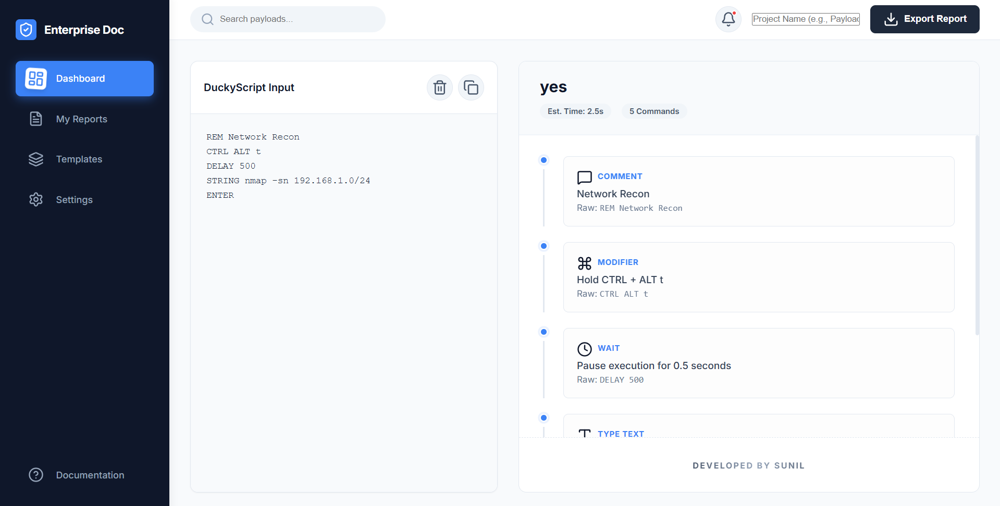
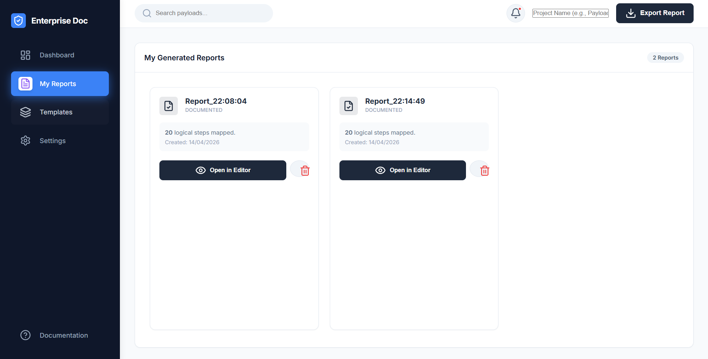
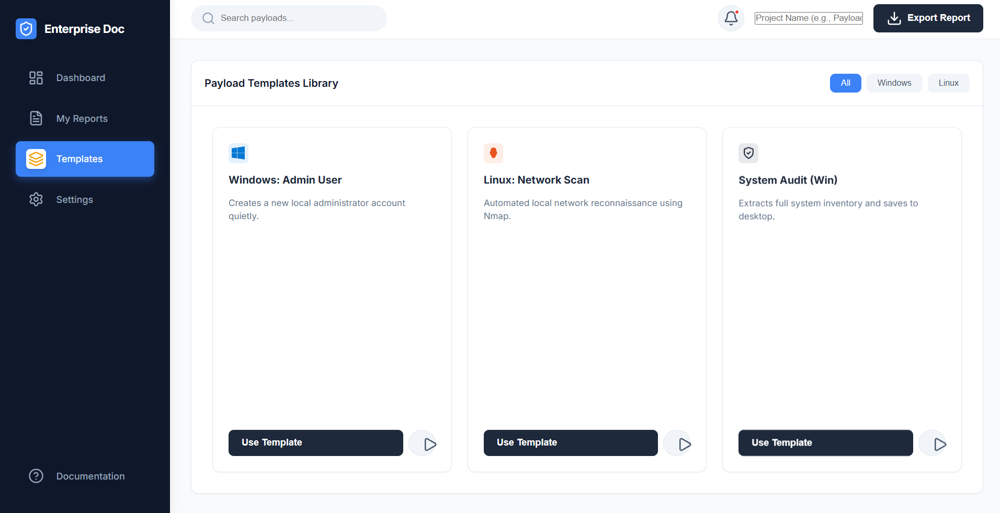
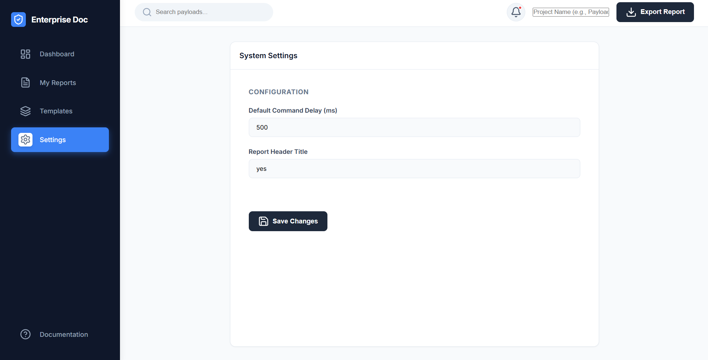

# 🛡️ Enterprise DuckyScript Auto-Documenter

A high-fidelity, professional documentation suite designed for security auditors, red-teamers, and penetration testers. Transform raw DuckyScript into audit-ready PDF documentation instantly.



## 🚀 Final Goal
The goal of this project is to provide a seamless, enterprise-grade interface for mapping keystroke payloads to logical, human-readable steps. It eliminates the manual effort of explaining scripts to stakeholders by providing automated, visual audit trails.

## ✨ Key Features

- **Live Parsing Engine**: Real-time visualization of DuckyScript commands with professional icons and descriptions.
- **Enterprise PDF Export**: Generate styled, branded reports including "Est. Execution Time" and "Complexity Analysis."
- **Payload Library**: A built-in library of common attack patterns (Windows, Linux, System Audit).
- **History Management**: Keep track of your documented scripts with the "My Reports" vault.
- **Contextual Search**: Instantly filter through templates and reports using the global search bar.
- **Branded Layout**: Professional dark-themed dashboard with "Developed by Sunil" security watermarking.

## 📸 Screenshots

### 📊 Professional Dashboard
The core interface featuring the dual-pane editor and documentation preview.


### 📂 Report Management
Organize and store your documented payloads in a structured, searchable vault.


### 📚 Template Library
Access a collection of high-impact security scripts with one click.


### ⚙️ Customizable Settings
Configure global documentation parameters like default delays and report headers.


## 🛠️ Tech Stack

- **Core**: HTML5, Vanilla JavaScript (ES6+)
- **Styling**: Premium CSS3 with Glassmorphism and CSS Variables
- **Icons**: Lucide Icons for high-fidelity UI
- **Exporting**: html2pdf.js for serverless PDF generation
- **Build Tool**: Vite for lightning-fast development

## 📦 Installation & Setup

1. **Clone the repository**:
   ```bash
   git clone https://github.com/Sunil56224972/DuckyScript-Auto-Documenter.git
   ```

2. **Install dependencies**:
   ```bash
   npm install
   ```

3. **Run the development server**:
   ```bash
   npm run dev
   ```

4. **Build for production**:
   ```bash
   npm run build
   ```

## 🛡️ Security Disclaimer
This tool is intended for professional security auditing and educational purposes only. Always obtain explicit authorization before executing DuckyScripts on systems you do not own.

---
**Developed with ❤️ by [Sunil](https://github.com/Sunil56224972)**

### 🌐 Live Demo
Explore the interactive dashboard here: **[ducky-script-auto-documenter.vercel.app](https://ducky-script-auto-documenter.vercel.app/)**
